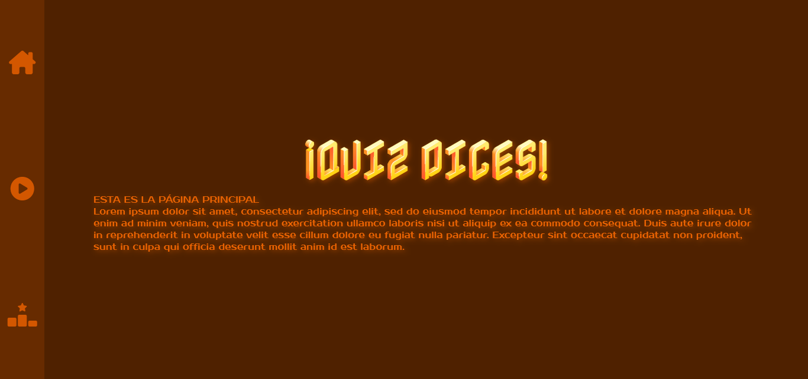

# HOJA DE RUTA Y ANOTACIONES

## [Enunciado del Proyecto Quiz](./enunciado.md)

## TO DO:

> [!NOTE]
> ✅ Hecho main y estilos. Funciona todo perfecto.

> [!NOTE]
> ✅ SPA HECHO.

> [!NOTE]
> 🖌 Añadir reglas CSS para el contenido.

> [!NOTE]
> 🪄 Fetch API -> Analizar✅, entender✅ y usarla❌.

> [!WARNING]
> ❌ ALGORITMOS.

✅Estructura de la web.

✅Estilo de la web: colores, fuentes, distribución, textos...

✅DOM avanzado: Creación de SPA, secciones, borrado y creaciones de contenido.

✅Falso footer.

✅Fetch y guardado de valores para su uso posterior.

✅Decodear formato de la API - Meter el valor en el textarea

```
function decodeHtml(html) {
	var txt = document.createElement("textarea");
	txt.innerHTML = html;
	return txt.value;
}
```

✅Separar botones del div de la lista.

✅Estructura pensada para la interfaz del Quiz.

✅Darle una vuelta con el script: doingListContent()

✅Algoritmo de aleatoridad de las opciones.

✅"Oculta" la respuesta correcta.

✅Echar par de ojos a la variable iQuiz.

⏳Cuando termine las 10 preguntas, llevarte a la "página" de score.

⏳Nueva partida debería enseñar otro quiz de 10 preguntas.

✅Dar estilo al quiz.

⏳⏳⏳Por desglosar puntuación...


## WEB VIEW ACTUAL

Las tres secciones se ven de tal manera:



## ANOTACIONES

Colores definitivos para documentar:
#D3570080/rgba(211, 87, 0, 0.5), #672B00, #4F2100, #EB6302

FUENTES POSIBLES
- https://fonts.google.com/specimen/Electrolize?preview.text=Bienvenutti&lang=es_Latn&categoryFilters=Appearance:%2FTheme%2FTechno
- https://fonts.google.com/specimen/Zen+Dots?preview.text=Bienvenutti&lang=es_Latn&categoryFilters=Appearance:%2FTheme%2FTechno
- https://fonts.google.com/specimen/Prosto+One?preview.text=Bienvenutti&lang=es_Latn&categoryFilters=Appearance:%2FTheme%2FTechno
- https://fonts.google.com/specimen/Share+Tech+Mono?preview.text=Bienvenutti&lang=es_Latn&categoryFilters=Appearance:%2FTheme%2FTechno
- https://fonts.google.com/specimen/Nabla?preview.text=Bienvenutti&lang=es_Latn&categoryFilters=Appearance:%2FTheme%2FTechno
- https://fonts.google.com/specimen/Baumans?preview.text=Bienvenutti&lang=es_Latn&categoryFilters=Appearance:%2FTheme%2FTechno
